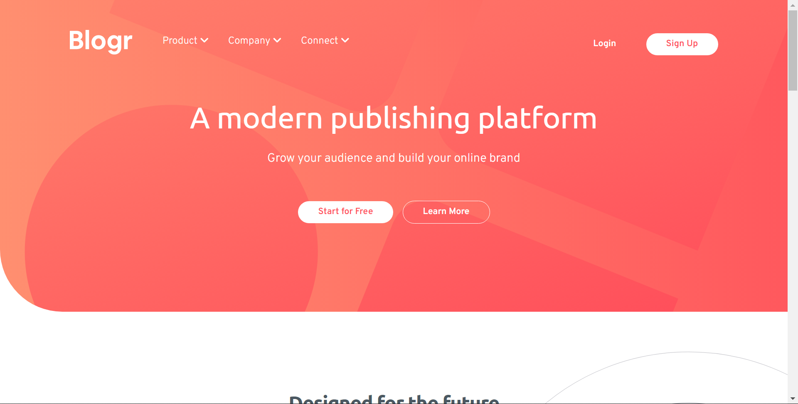

# Frontend Mentor - Blogr landing page solution

This is a solution to the [Blogr landing page challenge on Frontend Mentor](https://www.frontendmentor.io/challenges/blogr-landing-page-EX2RLAApP). Frontend Mentor challenges help you improve your coding skills by building realistic projects.

## Table of contents

- [Overview](#overview)
  - [The challenge](#the-challenge)
  - [Screenshot](#screenshot)
  - [Links](#links)
- [My process](#my-process)
  - [Built with](#built-with)
  - [What I learned](#what-i-learned)
- [Author](#author)
- [Acknowledgments](#acknowledgments)

**Note: Delete this note and update the table of contents based on what sections you keep.**

## Overview

### The challenge

Users should be able to:

- View the optimal layout for the site depending on their device's screen size
- See hover states for all interactive elements on the page

### Screenshot

### Links

- Live Site URL: [Add live site URL here](https://dazzling-leavitt-9539c5.netlify.app/)

## My process

I started with setting up custom variables, the hsl provided was actually a real pain, I tried to see if it's worth it to work with a hsl variable (its not for me) next time I will stick to hexcodes based on hsl values.

I made the desktop version of the site first. Section by section. And it was looking good. But then did mobile after to the specified size... its okay, but anything inbetween the two sizes gets iffy...

### Built with

- Semantic HTML5 markup
- CSS custom properties
- Flexbox
- CSS Grid

### What I learned

I learned some cool design patters for drop down menus and am really happy with how they look. Also practice using images and svgs as background images was useful.

I feel like mobile first would have been a much better way to approach this project, as I really struggled keeping everything looking good after the fact!

## Author

- Website - [Joseph Hagan](https://github.com/jhaganfilm)
- Frontend Mentor - [@jhaganfilm](https://www.frontendmentor.io/profile/yourusername)
- Twitter - [@imjoee](https://twitter.com/imjoee)

## Acknowledgments

Honestly I'm just greatful for this website as after finishing a load of web dev tutorials I was so stuck on what too make. My own projects were too ambitions and tutorials are too basic. This was a perfect challenge using what I know!
